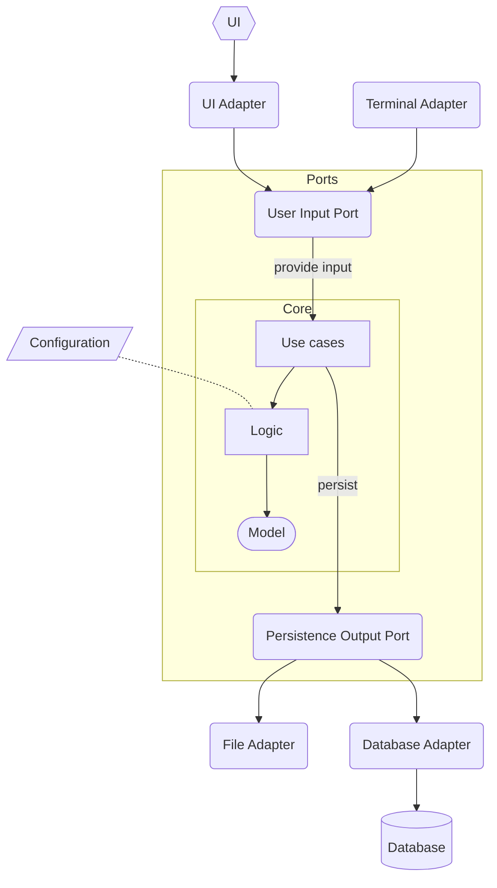

# Nonogram

## Idea

This is an application to solve nonograms.

## Structure

```mermaid
graph

%% Components
UI{{UI}}
UI_Ad(UI Adapter)
Term_Ad(Terminal Adapter)

In_P(User Input Port)
UseCases[Use cases]
Logic[Logic]
Model([Model])
CONFIG[/Configuration/]
Out_P(Persistence Output Port)

FS_Ad(File Adapter)
DB_Ad(Database Adapter)
DB[(Database)]


%% Input relationships
UI --> UI_Ad
UI_Ad --> In_P
Term_Ad --> In_P
CONFIG -.- Logic

subgraph PORTS[Ports]
    In_P
    Out_P
    In_P -- provide input --> UseCases
    UseCases -- persist ----> Out_P
    UseCases --> Logic
    Logic --> Model

    subgraph CORE[Core]
        Logic
        Model
        UseCases
    end
end

%% Output relationships
Out_P --> DB_Ad
DB_Ad --> DB
Out_P --> FS_Ad


%% Links
click UI_Ad "https://github.com/Plecki/nonogram/tree/main/presentation/src/main/kotlin/com/example/nonogram/desktop" _blank
click Term_Ad "https://github.com/Plecki/nonogram/tree/main/presentation/src/main/kotlin/com/example/nonogram/terminal" _blank

click In_P "https://github.com/Plecki/nonogram/tree/main/application/src/main/kotlin/port/presentation" _blank
click UseCases "https://github.com/Plecki/nonogram/tree/main/application/src/main/kotlin/usecase" _blank
click Model "https://github.com/Plecki/nonogram/tree/main/application/src/main/kotlin/domain/model" _blank
click Out_P "https://github.com/Plecki/nonogram/tree/main/application/src/main/kotlin/port/persistence" _blank

click FS_Ad "https://github.com/Plecki/nonogram/tree/main/persistence/src/main/kotlin" _blank
```